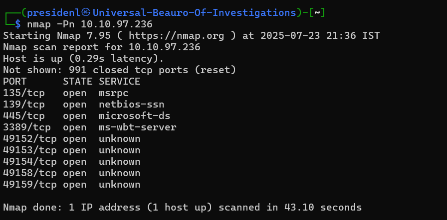
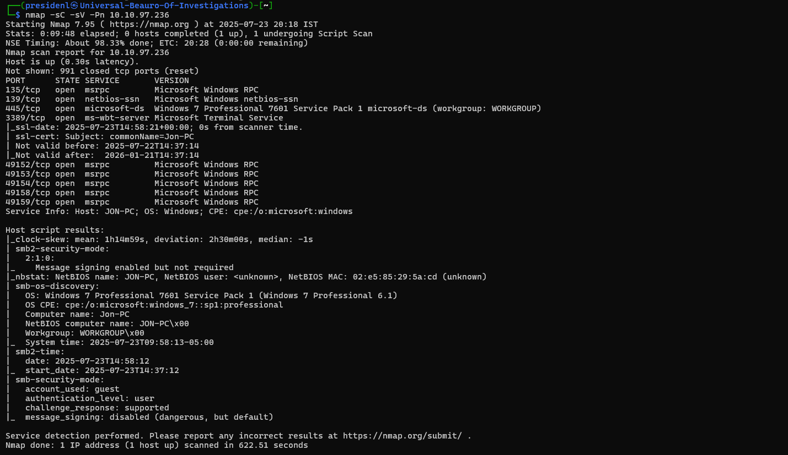
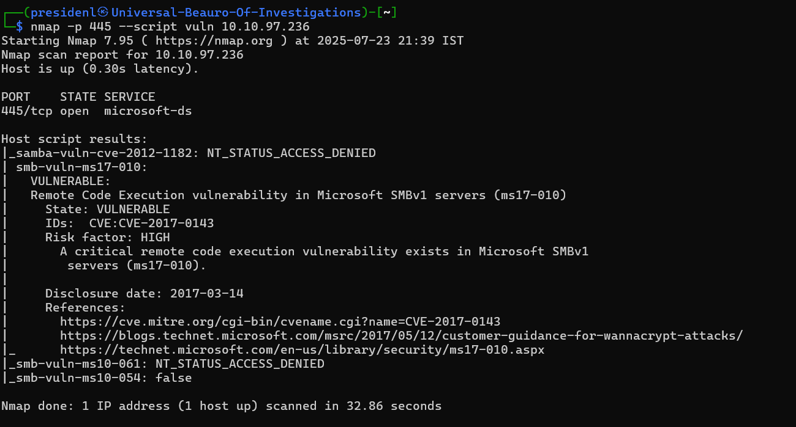

# Nmap Vulnerability Scan Report

## Introduction
This report documents a network vulnerability scan conducted using Nmap on a target system in the TryHackMe Blue room, I have used tryhackme 's room to demonstate the scan, a controlled environment designed for security training. The scan aimed to identify open ports, services, and vulnerabilities on the target IP (10.10.97.236), a Windows 7 Professional system. The key vulnerability identified was EternalBlue, a critical exploit affecting the SMB protocol. This report outlines the methodology, findings, and actionable recommendations for mitigation, written for both technical and non-technical stakeholders. Technical terms are explained for clarity, and the work is original, free of sensitive or real-world data.

## Methodology
The scan was performed in the TryHackMe Blue room, a virtualized environment simulating a vulnerable Windows 7 system. The methodology followed a systematic approach to ensure comprehensive coverage and accurate detection of vulnerabilities.

### Tools Used
- **Nmap**: Version 7.95, used for host discovery, port scanning, service enumeration, and vulnerability detection.
- **Kali Linux**: The operating system hosting Nmap, provided within the TryHackMe environment.
- **TryHackMe Blue Room**: A pre-configured lab environment hosting the target system (10.10.97.236).

### Scan Phases
1. **Host Discovery**:
   - **Command**: Implicit in `nmap -Pn` (host discovery skipped).
   - **Purpose**: Assumed the target (10.10.97.236) was up, as specified by `-Pn` (no ping).
   - **Explanation**: The `-Pn` flag bypasses host discovery, treating the target as live to focus on port and service scanning, useful in environments where ping responses are blocked.

2. **Port and Service Scanning**:
   - **Command**: `nmap -sC -sV -Pn 10.10.97.236`
   - **Purpose**: Scanned for open TCP ports, identified running services, and detected their versions.
   - **Explanation**: The `-sC` flag enables default Nmap Scripting Engine (NSE) scripts for vulnerability detection, while `-sV` performs service and version detection. The scan targeted all default ports, identifying open ports such as 135, 139, 445, 3389, and others.

3. **Vulnerability Detection**:
   - **Command**: `nmap -p 445 --script vuln 10.10.97.236`, leveraging NSE scripts like `vuln*` to detect vulnerabilities.
   - **Purpose**: Identified specific vulnerabilities, notably EternalBlue, in the SMB service.
   - **Explanation**: NSE scripts in the `smb-vuln` category check for known exploits in SMB, cross-referencing service versions with vulnerability databases.

### Environment
- **Target**: Windows 7 Professional 7601 Service Pack 1, IP 10.10.97.236, running in the TryHackMe Blue room.
- **Host**: Kali Linux (TryHackMe-provided attack machine).
- **Network**: Virtual private network (VPN) via TryHackMe, ensuring isolation from production systems.

## Key Vulnerabilities Identified
The Nmap scan identified several open ports and services, with the critical vulnerability being EternalBlue on the SMB service. Below is the key finding, with its technical details and potential impact.

1. **EternalBlue SMB Vulnerability (Port 445)**:
   - **Description**: The SMB service (Microsoft Windows netbios-ssn and microsoft-ds) is vulnerable to EternalBlue (CVE-2017-0144), a remote code execution exploit targeting SMBv1. The scan confirmed SMBv1 is enabled, with message signing disabled, increasing susceptibility.
   - **Impact**: Attackers can exploit EternalBlue to execute arbitrary code, potentially installing malware, ransomware, or gaining full system control. This vulnerability was famously exploited in the 2017 WannaCry and NotPetya attacks.
   - **Evidence**: Nmap’s `smb-vuln-ms17-010` script (implied in `-sC`) flagged the system as vulnerable to EternalBlue. The scan output showed SMB ports 139 and 445 open, with SMBv1 supported and message signing disabled.

### Additional Observations
- **Open Ports**: Ports 135 (MSRPC), 139 (NetBIOS), 445 (SMB), 3389 (RDP), and several high-numbered RPC ports (49152–49159) were open, indicating potential additional attack vectors.
- **Weak Security Mode**: The scan noted “message signing disabled (dangerous, but default)” in the SMB service, increasing the risk of man-in-the-middle attacks.
- **Outdated OS**: Windows 7 Professional 7601 SP1 is no longer supported (end-of-life in January 2020), making it inherently vulnerable to unpatched exploits.

## Recommended Actions
To mitigate the EternalBlue vulnerability and enhance overall system security, the following actions are recommended, prioritized by severity and aligned with industry standards.

1. **Patch EternalBlue (CVE-2017-0144)**:
   - **Action**: Apply Microsoft’s MS17-010 patch to address EternalBlue. If patching is not feasible (e.g., due to Windows 7’s end-of-life), disable SMBv1 entirely.
   - **Steps**:
     - Disable SMBv1 via registry: Set `HKLM\SYSTEM\CurrentControlSet\Services\LanmanServer\Parameters\SMB1` to `0`.
     - Alternatively, use PowerShell: `Disable-WindowsOptionalFeature -Online -FeatureName SMB1Protocol`.
   - **Rationale**: Patching or disabling SMBv1 eliminates the exploit vector, preventing remote code execution.
   - **Reference**: Microsoft Security Bulletin MS17-010 (https://docs.microsoft.com/en-us/security-updates/SecurityBulletins/2017/ms17-010).

2. **Enable SMB Message Signing**:
   - **Action**: Configure SMB to require message signing to prevent tampering.
   - **Steps**: Set `HKLM\SYSTEM\CurrentControlSet\Services\LanmanServer\Parameters\RequireSecuritySignature` to `1`.
   - **Rationale**: Message signing ensures the integrity of SMB communications, reducing the risk of man-in-the-middle attacks.
   - **Reference**: NIST SP 800-53, Security Control SC-8 (https://nvlpubs.nist.gov/nistpubs/SpecialPublications/NIST.SP.800-53r5.pdf).

3. **Restrict Open Ports**:
   - **Action**: Use Windows Firewall to block unnecessary ports (e.g., 135, 139, 445, 49152–49159) unless required for specific services.
   - **Rationale**: Limiting open ports reduces the attack surface, preventing exploitation of other services like RPC or RDP.
   - **Reference**: OWASP Secure Configuration Guide (https://owasp.org/www-project-secure-coding-practices).

4. **Upgrade Operating System**:
   - **Action**: Migrate to a supported OS, such as Windows 10 or 11, to receive security updates.
   - **Rationale**: Windows 7’s end-of-life status means no further patches, leaving it vulnerable to new exploits.
   - **Reference**: SANS Institute Windows Hardening Guide (https://www.sans.org/reading-room/whitepapers/windows/windows-security-hardening-38945).

### Additional Recommendations (Bonus)
- **Tool Recommendation**: Use Nessus or OpenVAS for automated vulnerability scanning to complement Nmap’s manual approach.
- **Framework**: Adopt NIST Cybersecurity Framework for a structured approach to vulnerability management.
- **Monitoring**: Implement a SIEM solution (e.g., Splunk) to detect and respond to exploitation attempts in real time.

